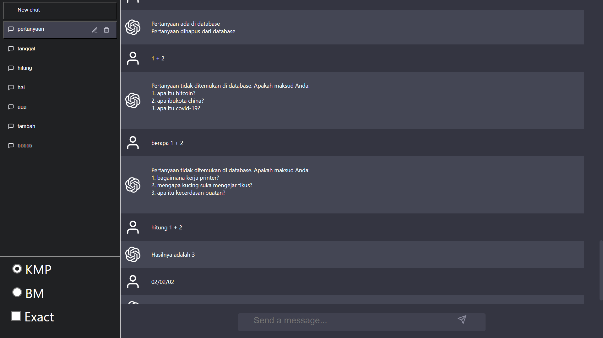
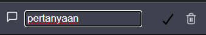
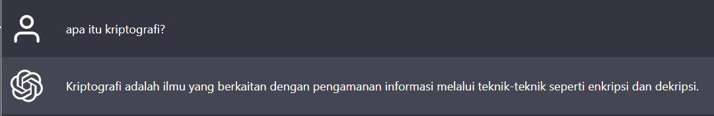
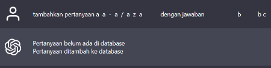
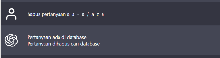
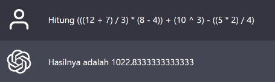
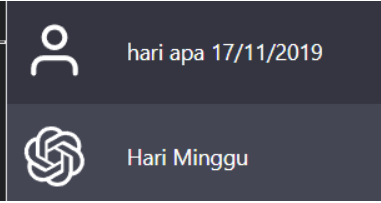

# Tubes3_13521110

Implementasi algoritma String Matching dalam program chatGPT sederhana

## Table of Contents

- [Tubes3\_13521110](#tubes3_13521110)
  - [Table of Contents](#table-of-contents)
  - [Aplikasi algoritma String Matching dalam program chatGPT sederhana](#aplikasi-algoritma-string-matching-dalam-program-chatgpt-sederhana)
  - [Requirements](#requirements)
  - [How to run](#how-to-run)
  - [Cara pemakaian program](#cara-pemakaian-program)
  - [Contoh Tampilan Program](#contoh-tampilan-program)
  - [Project Status](#project-status)

## Aplikasi algoritma String Matching dalam program chatGPT sederhana

Implementasi algoritma KMP (Knuth-Morris-Pratt) dan BM (Boyer-Moore) untuk penentuan string yang exact match dari pertanyaan database sebagai jawaban dari aplikasi. Selain itu, implementasi Algoritma Levenshtein Distance untuk aproksimasi kemiripan string berguna dalam pembuatan ChatBot yang semi-intelligent. Terdapat pula fitur kalkulator dan penyebut hari di aplikasi tersebut.

## Requirements

1. Koneksi internet
2. Browser dan disarankan menggunakan Google Chrome
3. golang untuk menjalankan backend

    Dapat di-install dari link berikut

    <https://go.dev/doc/install>

4. node.js untuk menjalankan frontend

   Dapat di-install dari link berikut

   <https://nodejs.org/en/download>

5. Meng-clone repository ini dengan command (memerlukan git)

    ```shell
    git clone https://github.com/yansans/Tubes3_13521110.git
    ```

    atau dapat men-download langsung dengan mengklik tombol Code dan download zip.

6. Mendownload dependency golang dan node modules dengan command

    ```shell
    npm run dependency
    ```

7. Membuat file .env yang berisi API key yang akan digunakan untuk mengakses basis data

    file .env akan berisi seperti berikut

    ```shell
    # db username
    user_db = <username>
    # db password
    pass_db = <password>
    ```

## How to run

Program dapat dijalankan dengan langkah sebagai berikut

1. Menyalakan server backend dengan command

    ```shell
    npm run go
    ```

2. Setelah server backend sudah berhasil dinyalakan, nyalakan server frontend pada terminal baru dengan command

    ```shell
    npm run web
    ```

3. Setelah server backend dan frontend sudah dinyalakan, aplikasi dapat diakses pada <http://localhost:3000/>

## Cara pemakaian program

1. Pengguna dapat membuat Chat Log baru dengan cara menekan tombol + new chat
2. Pengguna dapat mengubah nama Chat Log dengan menekan tombol pencil di sebelah kanan Chat Log yang sedang dibuka dan menekan tombol centang apabila sudah selesai mengubah
3. Pengguna dapat menghapus Chat Log dengan menekan tombol tong sampah di sebelah kanan Chat Log yang sedang dibuka
4. Pengguna dapat memilih jenis algoritma yang akan dipakai dengan memilih tombol pada bagian kiri bawah layar
5. Pengguna dapat mengirim message kepada chatbot dengan cara mengetik pada kolom chat yang berada pada bagian tengah bawah layar dan menekan tombol enter atau tombol pesawat kertas untuk mengirim pesan kepada chatbot
6. Pengguna dapat bertanya kepada chatbot dengan cara mengirim message kepada chatbot
7. Pengguna dapat menambahkan pertanyaan kedalam database dengan cara mengirim message dengan format

    ```shell
    tambahkan pertanyaan <pertanyaan> dengan jawaban <jawaban>    
    ```

8. Pengguna dapat menghapus pertanyaan dari database dengan cara mengirim message dengan format

    ```shell
    hapus pertanyaan <pertanyaan>
    ```

9. Pengguna dapat bertanya hasil operasi aritmatika dengan cara mengirim message dengan format

    ```shell
    <operasi aritmatika>
    ```

    atau

    ```shell
    hitung <operasi aritmatika>
    ```

10. Pengguna dapat bertanya nama hari pada tanggal tertentu dengan cara mengirim message dengan format

    ```shell
    <hari>/<bulan>/<tahun>
    ```

    atau

    ```shell
    hari apa <hari>/<bulan>/<tahun>
    ```

11. Pengguna dapat mengirim banyak perintah sekaligus dengan menggunakan pemisah "dan" diantara perintah yang diberikan

## Contoh Tampilan Program

1. Tampilan saat program pertama kali dibuka

    

2. Tampilan saat mengubah nama Chat Log

    

3. Tampilan saat bertanya kepada chatbot

    

4. Tampilan saat menambah pertanyaan kedalam database

    

5. Tampilan saat menghapus pertanyaan dari database

    

6. Tampilan saat bertanya hasil operasi matematika

    

7. Tampilan saat bertanya nama hari

    

## Project Status

Disusun Oleh :

Kelompok botman

- Yanuar Sano Nur Rasyid (13521110)
- Rayhan Hanif Maulana Pradana (13521112)
- Dewana Gustavus Haraka Otang (13521173)

Project is: _complete_
